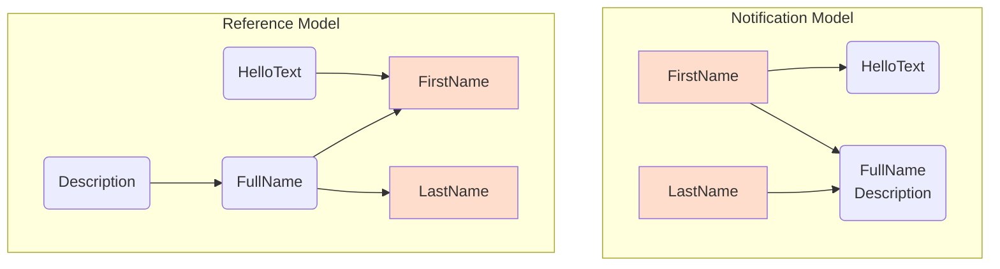

# Observable Feature (Preview)

<br/>

This feature is used to simplify the coding of the notification model.

For example:

[!code-csharp[](../../../Tests/NStandard.Test/Analyzer/ObservableFeatureTests.cs#doc_ObservableFeature)]

The analyzer will automatically collect dependencies at compile time to generate the notification calls:



In complex scenarios, this feature can significantly reduce the amount of code, freeing developers from the task of manually maintaining notification properties and thus improving code quality.

###### [Similar MVVM code](#tab/mvvm)

```csharp
public partial class ObservablePerson_Mvvm : ObservableObject
{
    [ObservableProperty]
    [NotifyPropertyChangedFor(nameof(FullName), nameof(Description), nameof(HelloText))]
    public string firstName;

    [ObservableProperty]
    [NotifyPropertyChangedFor(nameof(FullName), nameof(Description))]
    public string lastName;

    public string FullName => $"{FirstName} {LastName}";
    public string HelloText => $"Hello {FirstName}";
    public string Description => $"This person's name is {FullName}.";
}
```

###### [Generated code](#tab/mvvm-g)

```csharp
public partial class ObservablePerson : INotifyPropertyChanging, INotifyPropertyChanged
{
    public event PropertyChangingEventHandler PropertyChanging;
    public event PropertyChangedEventHandler PropertyChanged;
    
    private string backing_FirstName;
    public partial string FirstName
    {
        get => backing_FirstName;
        set
        {
            if (!EqualityComparer<string>.Default.Equals(backing_FirstName, value))
            {
                PropertyChanging?.Invoke(this, new PropertyChangingEventArgs("FirstName"));
                PropertyChanging?.Invoke(this, new PropertyChangingEventArgs("FullName"));
                PropertyChanging?.Invoke(this, new PropertyChangingEventArgs("HelloText"));
                PropertyChanging?.Invoke(this, new PropertyChangingEventArgs("Description"));
                backing_FirstName = value;
                PropertyChanged?.Invoke(this, new PropertyChangedEventArgs("FirstName"));
                PropertyChanged?.Invoke(this, new PropertyChangedEventArgs("FullName"));
                PropertyChanged?.Invoke(this, new PropertyChangedEventArgs("HelloText"));
                PropertyChanged?.Invoke(this, new PropertyChangedEventArgs("Description"));
            }
        }
    }
    private string backing_LastName;
    public partial string LastName
    {
        get => backing_LastName;
        set
        {
            if (!EqualityComparer<string>.Default.Equals(backing_LastName, value))
            {
                PropertyChanging?.Invoke(this, new PropertyChangingEventArgs("LastName"));
                PropertyChanging?.Invoke(this, new PropertyChangingEventArgs("FullName"));
                PropertyChanging?.Invoke(this, new PropertyChangingEventArgs("Description"));
                backing_LastName = value;
                PropertyChanged?.Invoke(this, new PropertyChangedEventArgs("LastName"));
                PropertyChanged?.Invoke(this, new PropertyChangedEventArgs("FullName"));
                PropertyChanged?.Invoke(this, new PropertyChangedEventArgs("Description"));
            }
        }
    }
}
```

---

Compared to using **NotifyPropertyChangedFor** to mark reference locations, this feature can significantly reduce the amount of code in complex reference scenarios.

<br/>

## Dependency collection

Dependency collection is limited to **properties**, including the following areas:

- Arrow syntax
- **Getter** areas.

### Another example

###### [KDA Score](#tab/kda)

[!code-csharp[](../../../Tests/NStandard.Test/Analyzer/ObservableFeatureTests.cs#doc_KDA)]

###### [Generated code](#tab/kda-g)

```csharp
public partial class KDA : INotifyPropertyChanging, INotifyPropertyChanged
{
    public event PropertyChangingEventHandler PropertyChanging;
    public event PropertyChangedEventHandler PropertyChanged;
    
    private int backing_Kills;
    public partial int Kills
    {
        get => backing_Kills;
        set
        {
            if (!EqualityComparer<int>.Default.Equals(backing_Kills, value))
            {
                PropertyChanging?.Invoke(this, new PropertyChangingEventArgs("Kills"));
                PropertyChanging?.Invoke(this, new PropertyChangingEventArgs("Score"));
                PropertyChanging?.Invoke(this, new PropertyChangingEventArgs("PanelColor"));
                backing_Kills = value;
                PropertyChanged?.Invoke(this, new PropertyChangedEventArgs("Kills"));
                PropertyChanged?.Invoke(this, new PropertyChangedEventArgs("Score"));
                PropertyChanged?.Invoke(this, new PropertyChangedEventArgs("PanelColor"));
            }
        }
    }
    private int backing_Deaths;
    public partial int Deaths
    {
        get => backing_Deaths;
        set
        {
            if (!EqualityComparer<int>.Default.Equals(backing_Deaths, value))
            {
                PropertyChanging?.Invoke(this, new PropertyChangingEventArgs("Deaths"));
                PropertyChanging?.Invoke(this, new PropertyChangingEventArgs("Score"));
                PropertyChanging?.Invoke(this, new PropertyChangingEventArgs("PanelColor"));
                backing_Deaths = value;
                PropertyChanged?.Invoke(this, new PropertyChangedEventArgs("Deaths"));
                PropertyChanged?.Invoke(this, new PropertyChangedEventArgs("Score"));
                PropertyChanged?.Invoke(this, new PropertyChangedEventArgs("PanelColor"));
            }
        }
    }
    private int backing_Assists;
    public partial int Assists
    {
        get => backing_Assists;
        set
        {
            if (!EqualityComparer<int>.Default.Equals(backing_Assists, value))
            {
                PropertyChanging?.Invoke(this, new PropertyChangingEventArgs("Assists"));
                PropertyChanging?.Invoke(this, new PropertyChangingEventArgs("Score"));
                PropertyChanging?.Invoke(this, new PropertyChangingEventArgs("PanelColor"));
                backing_Assists = value;
                PropertyChanged?.Invoke(this, new PropertyChangedEventArgs("Assists"));
                PropertyChanged?.Invoke(this, new PropertyChangedEventArgs("Score"));
                PropertyChanged?.Invoke(this, new PropertyChangedEventArgs("PanelColor"));
            }
        }
    }
}
```

---

