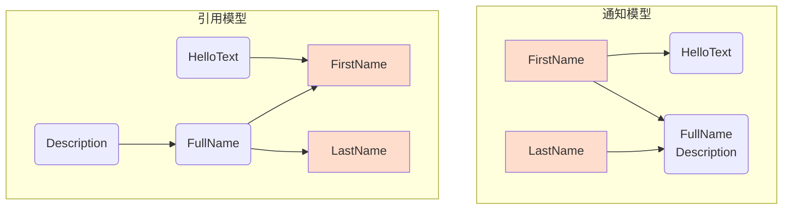

# Observable 特性（预览）

<br/>

该特性用于简化通知模型的代码编写。

例如：

[!code-csharp[](../../../Tests/NStandard.Test/Analyzer/ObservableFeatureTests.cs#doc_ObservableFeature)]

分析器将在编译时自动收集依赖项以生成通知调用：



在复杂场景下，该功能可以显著减少代码量，让开发者从手动维护通知属性的任务中解放出来，提升代码质量。

###### [相似的 MVVM 代码](#tab/mvvm)

```csharp
public partial class ObservablePerson_Mvvm : ObservableObject
{
    [ObservableProperty]
    [NotifyPropertyChangedFor(nameof(FullName), nameof(Description), nameof(HelloText))]
    public string firstName;

    [ObservableProperty]
    [NotifyPropertyChangedFor(nameof(FullName), nameof(Description))]
    public string lastName;

    public string FullName => $"{FirstName} {LastName}";
    public string HelloText => $"Hello {FirstName}";
    public string Description => $"This person's name is {FullName}.";
}
```

###### [生成代码](#tab/mvvm-g)

```csharp
public partial class ObservablePerson : INotifyPropertyChanging, INotifyPropertyChanged
{
    public event PropertyChangingEventHandler PropertyChanging;
    public event PropertyChangedEventHandler PropertyChanged;
    
    private string backing_FirstName;
    public partial string FirstName
    {
        get => backing_FirstName;
        set
        {
            if (!EqualityComparer<string>.Default.Equals(backing_FirstName, value))
            {
                PropertyChanging?.Invoke(this, new PropertyChangingEventArgs("FirstName"));
                PropertyChanging?.Invoke(this, new PropertyChangingEventArgs("FullName"));
                PropertyChanging?.Invoke(this, new PropertyChangingEventArgs("HelloText"));
                PropertyChanging?.Invoke(this, new PropertyChangingEventArgs("Description"));
                backing_FirstName = value;
                PropertyChanged?.Invoke(this, new PropertyChangedEventArgs("FirstName"));
                PropertyChanged?.Invoke(this, new PropertyChangedEventArgs("FullName"));
                PropertyChanged?.Invoke(this, new PropertyChangedEventArgs("HelloText"));
                PropertyChanged?.Invoke(this, new PropertyChangedEventArgs("Description"));
            }
        }
    }
    private string backing_LastName;
    public partial string LastName
    {
        get => backing_LastName;
        set
        {
            if (!EqualityComparer<string>.Default.Equals(backing_LastName, value))
            {
                PropertyChanging?.Invoke(this, new PropertyChangingEventArgs("LastName"));
                PropertyChanging?.Invoke(this, new PropertyChangingEventArgs("FullName"));
                PropertyChanging?.Invoke(this, new PropertyChangingEventArgs("Description"));
                backing_LastName = value;
                PropertyChanged?.Invoke(this, new PropertyChangedEventArgs("LastName"));
                PropertyChanged?.Invoke(this, new PropertyChangedEventArgs("FullName"));
                PropertyChanged?.Invoke(this, new PropertyChangedEventArgs("Description"));
            }
        }
    }
}
```

---

<br/>

## 依赖收集与通知属性

### 依赖收集

依赖收集仅限于 **属性**，且满足以下条件：

- 箭头语法
- **Getter** 区域

### 通知属性

通知属性仅限于 **属性**，且满足以下条件：

- 定义为 **partial**
- 不是 **static**
- 仅声明 **Getter** 和 **Setter**

<br/>

## 另一个例子

###### [KDA 分数](#tab/kda)

[!code-csharp[](../../../Tests/NStandard.Test/Analyzer/ObservableFeatureTests.cs#doc_KDA)]

###### [生成代码](#tab/kda-g)

```csharp
public partial class KDA : INotifyPropertyChanging, INotifyPropertyChanged
{
    public event PropertyChangingEventHandler PropertyChanging;
    public event PropertyChangedEventHandler PropertyChanged;
    
    private int backing_Kills;
    public partial int Kills
    {
        get => backing_Kills;
        set
        {
            if (!EqualityComparer<int>.Default.Equals(backing_Kills, value))
            {
                PropertyChanging?.Invoke(this, new PropertyChangingEventArgs("Kills"));
                PropertyChanging?.Invoke(this, new PropertyChangingEventArgs("Score"));
                PropertyChanging?.Invoke(this, new PropertyChangingEventArgs("PanelColor"));
                backing_Kills = value;
                PropertyChanged?.Invoke(this, new PropertyChangedEventArgs("Kills"));
                PropertyChanged?.Invoke(this, new PropertyChangedEventArgs("Score"));
                PropertyChanged?.Invoke(this, new PropertyChangedEventArgs("PanelColor"));
            }
        }
    }
    private int backing_Deaths;
    public partial int Deaths
    {
        get => backing_Deaths;
        set
        {
            if (!EqualityComparer<int>.Default.Equals(backing_Deaths, value))
            {
                PropertyChanging?.Invoke(this, new PropertyChangingEventArgs("Deaths"));
                PropertyChanging?.Invoke(this, new PropertyChangingEventArgs("Score"));
                PropertyChanging?.Invoke(this, new PropertyChangingEventArgs("PanelColor"));
                backing_Deaths = value;
                PropertyChanged?.Invoke(this, new PropertyChangedEventArgs("Deaths"));
                PropertyChanged?.Invoke(this, new PropertyChangedEventArgs("Score"));
                PropertyChanged?.Invoke(this, new PropertyChangedEventArgs("PanelColor"));
            }
        }
    }
    private int backing_Assists;
    public partial int Assists
    {
        get => backing_Assists;
        set
        {
            if (!EqualityComparer<int>.Default.Equals(backing_Assists, value))
            {
                PropertyChanging?.Invoke(this, new PropertyChangingEventArgs("Assists"));
                PropertyChanging?.Invoke(this, new PropertyChangingEventArgs("Score"));
                PropertyChanging?.Invoke(this, new PropertyChangingEventArgs("PanelColor"));
                backing_Assists = value;
                PropertyChanged?.Invoke(this, new PropertyChangedEventArgs("Assists"));
                PropertyChanged?.Invoke(this, new PropertyChangedEventArgs("Score"));
                PropertyChanged?.Invoke(this, new PropertyChangedEventArgs("PanelColor"));
            }
        }
    }
}
```

---

